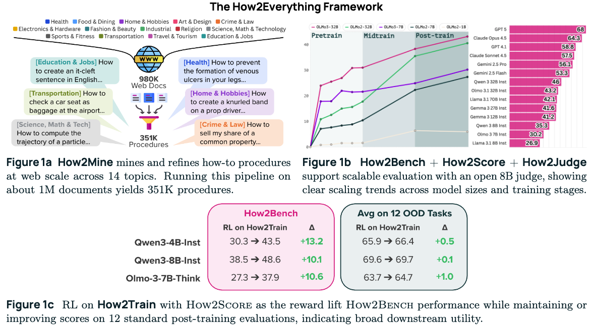

# How2Everything: Mining the Web for How-To Procedures to Evaluate and Improve LLMs

<p align="center">
  <a href="https://huggingface.co/collections/how2everything/how2everything">🤗 HuggingFace</a> &bull;
  <a href="https://arxiv.org/pdf/2602.08808">📄 Paper</a> &bull;
  <a href="https://allenai.org/blog/how2everything">📝 Blog Post</a>
</p>

## Overview



Generating step-by-step how-to procedures is a key LLM capability, and procedural reasoning underpins many downstream tasks. **How2Everything** is a scalable framework for evaluating and improving this capability. It shows how pretraining web data can support a closed loop of capability evaluation and improvement at scale. The three main components include:

- ⛏️ **How2Mine** — a multi-stage pipeline that mines structured procedures (goal + resources + steps) from web documents; running it on ~1M pages yields 351K procedures across 14 topics.
- 🎯 **How2Bench** — a 7K-example evaluation benchmark balanced across topics, with:
  - **How2Score** — an LLM-as-a-judge protocol that checks whether a generated procedure contains any *critical failure* that would prevent achieving the goal.
  - **How2Judge** — an open 8B judge (distilled from GPT-5) that achieves 80.5% agreement with human annotators, enabling low-cost, reproducible evaluation.
- 🚀 **How2Train** — the remaining mined procedures used as RL training data; using How2Score as a reward improves How2Bench performance by >10 points across three models without regressions on 12 standard benchmarks.

## Installation

Requires **Python >= 3.11** and [uv](https://docs.astral.sh/uv/).

```bash
uv venv && uv sync
```

API calls (OpenAI, Anthropic, Gemini) are handled by [lm-deluge](https://github.com/taylorai/lm-deluge), which handles rate limiting, retries, and provider-specific translation (OpenAI, Anthropic, Gemini, etc.). Local model inference uses [vLLM](https://github.com/vllm-project/vllm).

## Getting Started

Each component has its own documentation with usage instructions, configs, and examples:

- ⛏️ [How2Mine](examples/mine) — mine procedures from your own documents
- 🎯 [How2Bench](examples/bench) — evaluate models and reproduce the leaderboard
- 🚀 [How2Train](examples/train) — prepare training data and run RL with [open-instruct](https://github.com/allenai/open-instruct)

## Released Artifacts

All artifacts are available in the [How2Everything HuggingFace collection](https://huggingface.co/collections/how2everything/how2everything).

| Artifact | Description | Link |
|---|---|---|
| How2Judge | Open 8B judge model | [how2everything/how2judge](https://huggingface.co/how2everything/how2judge) |
| How2Mine | 351K procedures mined from 980K web docs | [how2everything/how2mine](https://huggingface.co/datasets/how2everything/how2mine) |
| How2Bench | 7K evaluation benchmark | [how2everything/how2bench](https://huggingface.co/datasets/how2everything/how2bench) |
| How2Train | Training set (deduped against How2Bench via [`dedup_against_test.py`](examples/train/dedup_against_test.py)) | [how2everything/how2train](https://huggingface.co/datasets/how2everything/how2train) |
| WildChat labeled | WildChat labeled by OpenAI query type classifier | [how2everything/WildChat-4.8M](https://huggingface.co/datasets/how2everything/WildChat-4.8M) |
| lmsys-chat labeled | lmsys-chat labeled by OpenAI query type classifier | [how2everything/lmsys-chat-1m](https://huggingface.co/datasets/how2everything/lmsys-chat-1m) |

## Citation

```bibtex
@misc{chang2026how2everythingminingwebhowto,
      title={How2Everything: Mining the Web for How-To Procedures to Evaluate and Improve LLMs}, 
      author={Yapei Chang and Kyle Lo and Mohit Iyyer and Luca Soldaini},
      year={2026},
      eprint={2602.08808},
      archivePrefix={arXiv},
      primaryClass={cs.LG},
      url={https://arxiv.org/abs/2602.08808}, 
}
```
